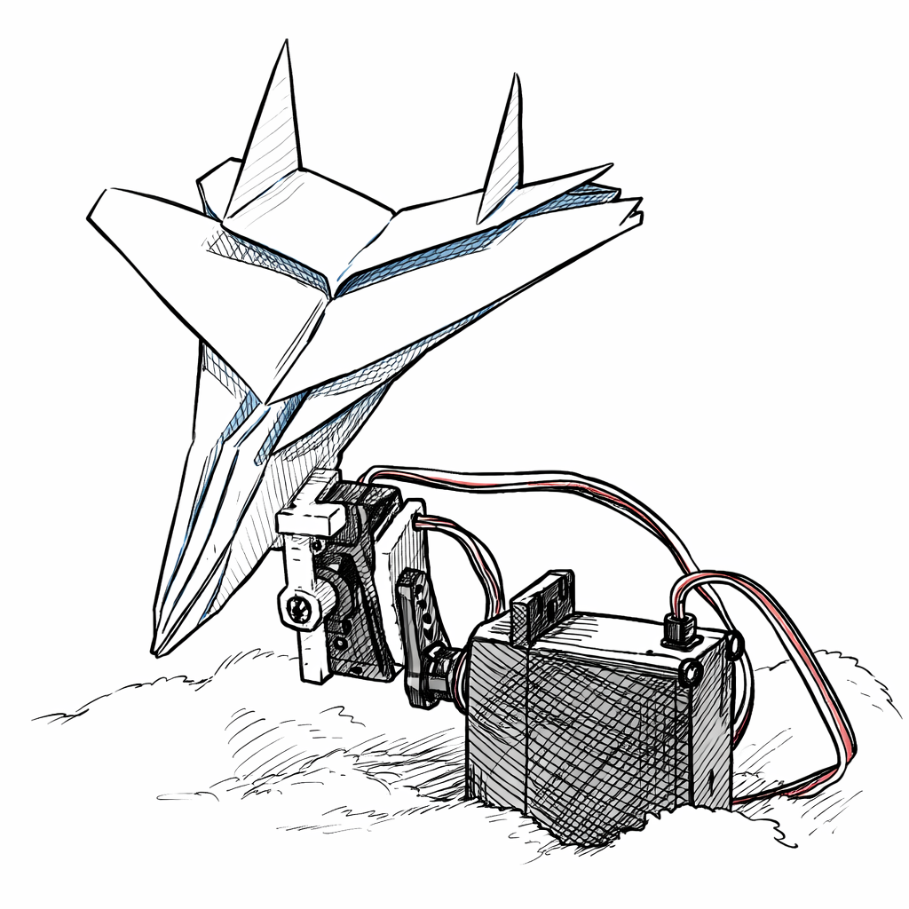

# **Práctica: Control de dos servomotores mediante IMU y comunicación Bluetooth entre dos ESP32**

---

## **Objetivo**

Desarrollar un sistema distribuido con dos tarjetas ESP32. La primera tarjeta deberá leer un sensor IMU y enviar por Bluetooth clásico dos valores asociados a la inclinación en los ejes X y Y. La segunda tarjeta deberá recibir dichos valores y controlar dos servomotores. Además, ambos ESP32 deberán indicar visualmente el estado de conexión utilizando el LED integrado del pin 2.

---

## **Introducción**

En esta práctica se integran tres elementos importantes dentro del área de telecomunicaciones en la industria: la adquisición de datos mediante sensores, la transmisión inalámbrica entre dispositivos embebidos y el accionamiento de actuadores.

El sensor utilizado será el **ISM330DHCX**, montado en un módulo SparkFun. Este dispositivo forma parte de la familia de sensores conocidos como **IMU** (Unidad de Medición Inercial). Un IMU permite medir variables asociadas al movimiento y la orientación. En esta práctica se emplearán principalmente los datos del acelerómetro para estimar la inclinación del módulo y convertir dicha inclinación en posiciones angulares para dos servomotores.

La transmisión de información se realizará mediante **Bluetooth clásico** entre dos ESP32. A diferencia de una conexión por nombre, en esta práctica la conexión se hará utilizando la **dirección MAC Bluetooth** del dispositivo receptor. Esta forma de conexión resulta más robusta cuando hay varios equipos trabajando al mismo tiempo en el mismo salón, ya que cada tarjeta posee una dirección única.

El ESP32 receptor moverá dos servomotores de acuerdo con los valores recibidos. El primer servo responderá al eje X y el segundo al eje Y. Durante la práctica también se usará el monitor serial para depurar y verificar el comportamiento del sistema.

---

## **Bibliotecas necesarias**

Para esta práctica se deben instalar y utilizar las siguientes bibliotecas.

### **Bibliotecas para el IMU**

```cpp
#include <Wire.h>
#include <SparkFun_ISM330DHCX.h>
```

### **Biblioteca para Bluetooth clásico**

```cpp
#include "BluetoothSerial.h"
```

### **Biblioteca para control de servomotores en ESP32**

```cpp
#include <ESP32Servo.h>
```

### **Biblioteca para obtener la MAC Bluetooth**

```cpp
#include "esp_bt_device.h"
```

---

## **Importante antes de comenzar**

La biblioteca:

```cpp
#include <ESP32Servo.h>
```

**sí se debe instalar** desde el administrador de bibliotecas del Arduino IDE.

Esta biblioteca es necesaria porque el ESP32 no utiliza la librería estándar `Servo.h` de la misma manera que una placa Arduino Uno. Para controlar servomotores con ESP32 debe utilizarse `ESP32Servo.h`.

---

## **Material necesario**

* 2 tarjetas ESP32
* 1 módulo IMU SparkFun con sensor ISM330DHCX
* 2 servomotores
* Cables Dupont
* Protoboard
* Fuente de alimentación adecuada para los servos
* Computadora con Arduino IDE
* Cable USB para programar cada ESP32

---

## **Descripción general del sistema**

El sistema estará dividido en dos partes.

### **ESP32 transmisor**

* Lee el IMU
* Calcula la inclinación
* Convierte la inclinación en dos valores entre 0 y 180
* Envía esos valores por Bluetooth
* Muestra información en serial
* Indica el estado del enlace con el LED 2

### **ESP32 receptor**

* Espera la conexión Bluetooth
* Recibe los valores enviados
* Controla dos servomotores
* Muestra las posiciones en serial
* Indica el estado del enlace con el LED 2

---

## **Comportamiento del LED**

En ambos ESP32 se utilizará el LED conectado al pin 2 para mostrar el estado del sistema.

* **Parpadeo lento**: no conectado
* **Parpadeo rápido**: intentando conectar
* **Encendido fijo**: conectado

---

# **Desarrollo**

---

## **Bloque 1. Preparación del entorno de trabajo**

Antes de cargar cualquier código, el estudiante debe verificar que el Arduino IDE tenga instaladas las bibliotecas necesarias.

### **Paso 1. Instalar la biblioteca del IMU**

En el administrador de bibliotecas buscar e instalar la biblioteca correspondiente al sensor SparkFun ISM330DHCX.

### **Paso 2. Instalar la biblioteca de servos**

Buscar e instalar:

```cpp
ESP32Servo
```

### **Paso 3. Verificar selección de tarjeta**

Seleccionar correctamente la tarjeta ESP32 que se esté utilizando.

### **Paso 4. Verificar puertos**

Conectar una tarjeta a la vez y verificar el puerto COM correspondiente.

---

## **Bloque 2. Obtención de la dirección MAC del receptor**

Para que el transmisor pueda enlazarse de manera correcta, primero se debe obtener la **MAC Bluetooth del ESP32 receptor**.

### **Procedimiento**

1. Cargar primero el programa del receptor.
2. Abrir el monitor serial.
3. Observar en pantalla la MAC Bluetooth impresa.
4. Copiar dicha dirección.
5. Pegarla en el código del transmisor dentro del arreglo `MAC_RECEPTOR`.

### **Ejemplo**

Si en el monitor serial aparece:

```cpp
24:6F:28:AA:BB:CC
```

Entonces en el transmisor se coloca:

```cpp
uint8_t MAC_RECEPTOR[6] = {0x24, 0x6F, 0x28, 0xAA, 0xBB, 0xCC};
```

---

## **Bloque 3. Conexión del IMU al ESP32 transmisor**

El IMU se conectará por protocolo I2C.

### **Conexiones**

* SDA → GPIO 21
* SCL → GPIO 22
* VCC → 3.3 V
* GND → GND

Estas conexiones corresponden a las usadas en el código con:

```cpp
Wire.begin(21, 22);
```

---

## **Bloque 4. Conexión de los servomotores al ESP32 receptor**

### **Conexiones**

* Servo X señal → GPIO 18
* Servo Y señal → GPIO 19
* Alimentación de servos → fuente externa adecuada
* Tierra de la fuente → GND común con el ESP32

### **Importante**

Si los servos demandan corriente considerable, no deben alimentarse directamente desde el ESP32. Se recomienda usar una fuente externa y compartir la referencia de tierra con la tarjeta.

---

## **Bloque 5. Código del ESP32 receptor**

Este código convierte al ESP32 en el dispositivo receptor Bluetooth. Su función será esperar la conexión, imprimir su dirección MAC, recibir los datos del transmisor y mover dos servos.

### **Código completo del receptor**

```cpp
#include "BluetoothSerial.h"
#include <ESP32Servo.h>
#include "esp_bt_device.h"

BluetoothSerial SerialBT;

#define LED_ESTADO 2

const char* NOMBRE_LOCAL_BT = "ESP32_SERVOS_EQ1";

Servo servoX;
Servo servoY;

const int PIN_SERVO_X = 18;
const int PIN_SERVO_Y = 19;

enum EstadoConexion {
  DESCONECTADO = 0,
  CONECTANDO = 1,
  CONECTADO = 2
};

EstadoConexion estadoConexion = DESCONECTADO;

unsigned long tLED = 0;

int posX = 90;
int posY = 90;

void imprimirMacBluetooth() {
  const uint8_t* btMac = esp_bt_dev_get_address();

  Serial.print("MAC Bluetooth de este ESP32: ");
  for (int i = 0; i < 6; i++) {
    if (btMac[i] < 16) Serial.print("0");
    Serial.print(btMac[i], HEX);
    if (i < 5) Serial.print(":");
  }
  Serial.println();
}

void actualizarLED() {
  unsigned long ahora = millis();

  switch (estadoConexion) {
    case DESCONECTADO:
      if (ahora - tLED >= 800) {
        tLED = ahora;
        digitalWrite(LED_ESTADO, !digitalRead(LED_ESTADO));
      }
      break;

    case CONECTANDO:
      if (ahora - tLED >= 200) {
        tLED = ahora;
        digitalWrite(LED_ESTADO, !digitalRead(LED_ESTADO));
      }
      break;

    case CONECTADO:
      digitalWrite(LED_ESTADO, HIGH);
      break;
  }
}

void procesarLinea(String linea) {
  linea.trim();

  int coma = linea.indexOf(',');
  if (coma == -1) return;

  String sx = linea.substring(0, coma);
  String sy = linea.substring(coma + 1);

  int nuevaX = sx.toInt();
  int nuevaY = sy.toInt();

  nuevaX = constrain(nuevaX, 0, 180);
  nuevaY = constrain(nuevaY, 0, 180);

  posX = nuevaX;
  posY = nuevaY;

  servoX.write(posX);
  servoY.write(posY);

  Serial.print("Servo X: ");
  Serial.print(posX);
  Serial.print("   Servo Y: ");
  Serial.println(posY);
}

void setup() {
  Serial.begin(115200);
  delay(1000);

  pinMode(LED_ESTADO, OUTPUT);
  digitalWrite(LED_ESTADO, LOW);

  Serial.println();
  Serial.println("=== ESP32 RECEPTOR SERVOS ===");

  if (!SerialBT.begin(NOMBRE_LOCAL_BT)) {
    Serial.println("Error al iniciar Bluetooth en modo esclavo.");
    while (true) {
      digitalWrite(LED_ESTADO, !digitalRead(LED_ESTADO));
      delay(200);
    }
  }

  Serial.print("Nombre Bluetooth local: ");
  Serial.println(NOMBRE_LOCAL_BT);

  imprimirMacBluetooth();

  servoX.attach(PIN_SERVO_X);
  servoY.attach(PIN_SERVO_Y);

  servoX.write(posX);
  servoY.write(posY);

  Serial.println("Esperando conexion del transmisor...");
  estadoConexion = DESCONECTADO;
}

void loop() {
  actualizarLED();

  if (SerialBT.hasClient()) {
    if (estadoConexion != CONECTADO) {
      estadoConexion = CONECTADO;
      Serial.println("Transmisor conectado.");
    }
  } else {
    if (estadoConexion != DESCONECTADO) {
      estadoConexion = DESCONECTADO;
      Serial.println("Transmisor desconectado.");
    }
  }

  while (SerialBT.available()) {
    String linea = SerialBT.readStringUntil('\n');
    procesarLinea(linea);
  }
}
```

---

## **Bloque 6. Código del ESP32 transmisor**

Este código se encargará de leer el IMU, estimar la inclinación, convertirla a un rango útil para los servos y enviar por Bluetooth los dos valores obtenidos.

### **Código completo del transmisor**

```cpp
#include <Wire.h>
#include <SparkFun_ISM330DHCX.h>
#include "BluetoothSerial.h"
#include "esp_bt_device.h"

BluetoothSerial SerialBT;
SparkFun_ISM330DHCX imu;

#define LED_ESTADO 2

const char* NOMBRE_LOCAL_BT = "ESP32_IMU_EQ1";

// Colocar aqui la MAC del ESP32 receptor
uint8_t MAC_RECEPTOR[6] = {0x24, 0x6F, 0x28, 0xAA, 0xBB, 0xCC};

enum EstadoConexion {
  DESCONECTADO = 0,
  CONECTANDO = 1,
  CONECTADO = 2
};

EstadoConexion estadoConexion = DESCONECTADO;

unsigned long tLED = 0;
unsigned long tIntento = 0;
unsigned long tEnvio = 0;
unsigned long tDebug = 0;

const float LIMITE_ANGULO = 45.0;
const unsigned long INTERVALO_ENVIO = 60;
const unsigned long INTERVALO_REINTENTO = 3000;
const unsigned long INTERVALO_DEBUG = 400;

float pitchFiltrado = 0.0f;
float rollFiltrado = 0.0f;

float pitch0 = 0.0f;
float roll0 = 0.0f;
bool calibrado = false;

void imprimirMacBluetooth() {
  const uint8_t* btMac = esp_bt_dev_get_address();

  Serial.print("MAC Bluetooth de este ESP32: ");
  for (int i = 0; i < 6; i++) {
    if (btMac[i] < 16) Serial.print("0");
    Serial.print(btMac[i], HEX);
    if (i < 5) Serial.print(":");
  }
  Serial.println();
}

float mapearFloat(float valor, float in_min, float in_max, float out_min, float out_max) {
  return (valor - in_min) * (out_max - out_min) / (in_max - in_min) + out_min;
}

void actualizarLED() {
  unsigned long ahora = millis();

  switch (estadoConexion) {
    case DESCONECTADO:
      if (ahora - tLED >= 800) {
        tLED = ahora;
        digitalWrite(LED_ESTADO, !digitalRead(LED_ESTADO));
      }
      break;

    case CONECTANDO:
      if (ahora - tLED >= 200) {
        tLED = ahora;
        digitalWrite(LED_ESTADO, !digitalRead(LED_ESTADO));
      }
      break;

    case CONECTADO:
      digitalWrite(LED_ESTADO, HIGH);
      break;
  }
}

void conectarIMU() {
  Wire.begin(21, 22);

  while (!imu.begin(Wire)) {
    Serial.println("No se detecta el ISM330DHCX. Reintentando...");
    delay(1000);
  }

  imu.setAccelFullScale(ISM_2g);
  imu.setGyroFullScale(ISM_250dps);
  imu.setAccelDataRate(ISM_XL_ODR_104Hz);
  imu.setGyroDataRate(ISM_GY_ODR_104Hz);

  Serial.println("IMU detectado correctamente.");
}

void calibrarCentro() {
  Serial.println("Calibrando centro del IMU... no mover el modulo.");

  const int N = 100;
  float sumaPitch = 0.0f;
  float sumaRoll = 0.0f;

  for (int i = 0; i < N; i++) {
    sfe_ism_data_t accel;

    if (imu.getAccel(&accel)) {
      float ax = accel.xData;
      float ay = accel.yData;
      float az = accel.zData;

      float pitch = atan2(-ax, sqrt(ay * ay + az * az)) * 180.0 / PI;
      float roll  = atan2( ay, az ) * 180.0 / PI;

      sumaPitch += pitch;
      sumaRoll  += roll;
    }

    delay(10);
  }

  pitch0 = sumaPitch / N;
  roll0  = sumaRoll / N;
  calibrado = true;

  Serial.print("Pitch offset: ");
  Serial.println(pitch0, 3);
  Serial.print("Roll offset: ");
  Serial.println(roll0, 3);
  Serial.println("Calibracion terminada.");
}

bool intentarConexionBT() {
  Serial.println("Intentando conectar por MAC...");
  estadoConexion = CONECTANDO;

  bool ok = SerialBT.connect(MAC_RECEPTOR);

  if (ok) {
    Serial.println("Conexion Bluetooth establecida.");
    estadoConexion = CONECTADO;
    return true;
  } else {
    Serial.println("No se pudo conectar.");
    estadoConexion = DESCONECTADO;
    return false;
  }
}

void setup() {
  Serial.begin(115200);
  delay(1000);

  pinMode(LED_ESTADO, OUTPUT);
  digitalWrite(LED_ESTADO, LOW);

  Serial.println();
  Serial.println("=== ESP32 TRANSMISOR IMU ===");

  if (!SerialBT.begin(NOMBRE_LOCAL_BT, true)) {
    Serial.println("Error al iniciar Bluetooth en modo maestro.");
    while (true) {
      digitalWrite(LED_ESTADO, !digitalRead(LED_ESTADO));
      delay(200);
    }
  }

  Serial.print("Nombre Bluetooth local: ");
  Serial.println(NOMBRE_LOCAL_BT);

  imprimirMacBluetooth();
  conectarIMU();
  calibrarCentro();

  estadoConexion = DESCONECTADO;
  tIntento = millis();
  tEnvio = millis();
  tDebug = millis();
}

void loop() {
  unsigned long ahora = millis();

  actualizarLED();

  if (!SerialBT.connected(0)) {
    if (estadoConexion == CONECTADO) {
      Serial.println("Conexion perdida.");
      estadoConexion = DESCONECTADO;
    }

    if (ahora - tIntento >= INTERVALO_REINTENTO) {
      tIntento = ahora;
      intentarConexionBT();
    }

    return;
  }

  estadoConexion = CONECTADO;

  if (ahora - tEnvio >= INTERVALO_ENVIO) {
    tEnvio = ahora;

    sfe_ism_data_t accel;

    if (imu.getAccel(&accel) && calibrado) {
      float ax = accel.xData;
      float ay = accel.yData;
      float az = accel.zData;

      float pitch = atan2(-ax, sqrt(ay * ay + az * az)) * 180.0 / PI;
      float roll  = atan2( ay, az ) * 180.0 / PI;

      pitch -= pitch0;
      roll  -= roll0;

      pitch = constrain(pitch, -LIMITE_ANGULO, LIMITE_ANGULO);
      roll  = constrain(roll,  -LIMITE_ANGULO, LIMITE_ANGULO);

      pitchFiltrado = 0.90f * pitchFiltrado + 0.10f * pitch;
      rollFiltrado  = 0.90f * rollFiltrado  + 0.10f * roll;

      int posServoX = (int) mapearFloat(rollFiltrado,  -LIMITE_ANGULO, LIMITE_ANGULO, 0, 180);
      int posServoY = (int) mapearFloat(pitchFiltrado, -LIMITE_ANGULO, LIMITE_ANGULO, 0, 180);

      posServoX = constrain(posServoX, 0, 180);
      posServoY = constrain(posServoY, 0, 180);

      String mensaje = String(posServoX) + "," + String(posServoY);
      SerialBT.println(mensaje);

      if (ahora - tDebug >= INTERVALO_DEBUG) {
        tDebug = ahora;

        Serial.print("Roll: ");
        Serial.print(rollFiltrado, 2);
        Serial.print("  Pitch: ");
        Serial.print(pitchFiltrado, 2);
        Serial.print("  => ServoX: ");
        Serial.print(posServoX);
        Serial.print("  ServoY: ");
        Serial.println(posServoY);
      }
    }
  }
}
```

---

## **Bloque 7. Procedimiento de prueba**

### **Parte 1. Preparar el receptor**

1. Cargar el código del receptor.
2. Abrir el monitor serial.
3. Esperar a que se imprima la MAC Bluetooth.
4. Copiar esa dirección.

### **Parte 2. Configurar el transmisor**

1. Abrir el código del transmisor.
2. Localizar el arreglo:

```cpp
uint8_t MAC_RECEPTOR[6] = { ... };
```

3. Sustituir sus valores por la MAC real del receptor.
4. Cargar el código del transmisor.

### **Parte 3. Verificar la conexión**

1. Encender primero el receptor.
2. Encender después el transmisor.
3. Observar el comportamiento de los LEDs.
4. Confirmar en serial si la conexión se estableció correctamente.

### **Parte 4. Verificar el movimiento**

1. Inclinar el IMU hacia un lado y observar el movimiento del servo X.
2. Inclinar el IMU hacia adelante o atrás y observar el movimiento del servo Y.
3. Verificar en el monitor serial del transmisor y del receptor los valores enviados y recibidos.

---
---
## Representación del sistema mecánico (movimiento en X y Y)



El sistema está conformado por dos servomotores acoplados, los cuales permiten inclinar un avión de papel en dos ejes:

- Eje X (roll): movimiento lateral (izquierda–derecha)  
- Eje Y (pitch): movimiento frontal (arriba–abajo)  

Cada servomotor controla un eje independiente, generando un movimiento combinado en el plano XY.

### Referencia visual (video)

Para comprender mejor el comportamiento del sistema acoplado, se recomienda observar el siguiente video:

https://www.youtube.com/watch?v=jC9NowQmyBo&t=82s

> Créditos de referencia conceptual: SparkFun Electronics.
---
---

## **Bloque 8. Explicación del funcionamiento**

El transmisor toma lecturas del acelerómetro y calcula dos ángulos aproximados: **pitch** y **roll**. Después de calibrar una posición inicial, cada ángulo se limita a un rango de trabajo definido por la constante `LIMITE_ANGULO`. Posteriormente, esos ángulos se convierten en valores de **0 a 180** para representar posiciones compatibles con un servomotor.

Los dos valores se empaquetan en una cadena de texto con formato:

```cpp
X,Y
```

Por ejemplo:

```cpp
90,135
```

El receptor recibe la cadena, la separa usando la coma como delimitador y escribe cada valor en su servomotor correspondiente.

---

## **Bloque 9. Actividad de comprobación**

Realizar las siguientes modificaciones al sistema:

1. Invertir el movimiento del servo X o del servo Y.
2. Cambiar el rango de movimiento útil para que el servo solo se desplace de 30 a 150 grados.
3. Modificar la sensibilidad ajustando el valor de `LIMITE_ANGULO`.
4. Describir qué ocurre si se elimina el filtrado aplicado a `pitchFiltrado` y `rollFiltrado`.
5. Probar una inclinación suave y una inclinación brusca, y comparar el comportamiento observado.

---

## **Conclusión esperada**

Al finalizar esta práctica, el estudiante deberá ser capaz de integrar un sensor IMU, dos microcontroladores ESP32 y dos servomotores dentro de un mismo sistema distribuido. También deberá comprender por qué una conexión por dirección MAC resulta más confiable que una conexión por nombre en entornos donde existen múltiples dispositivos trabajando simultáneamente.

---

## **Observaciones finales**

* La biblioteca `ESP32Servo.h` es obligatoria para esta práctica.
* La MAC del receptor debe copiarse correctamente en el transmisor.
* Los servomotores deben alimentarse adecuadamente.
* El monitor serial debe utilizarse durante toda la práctica como herramienta de depuración.
